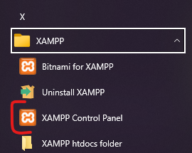
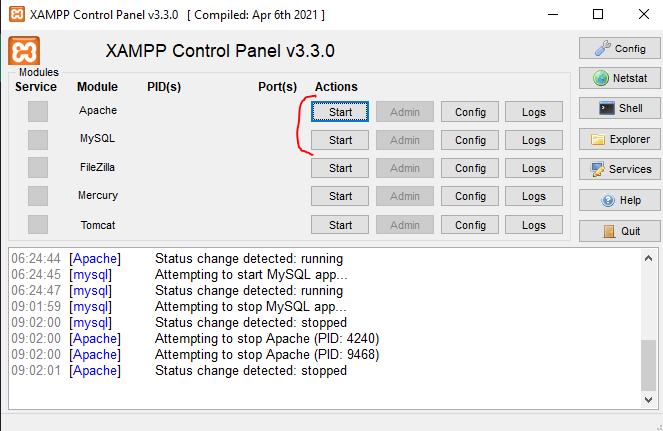
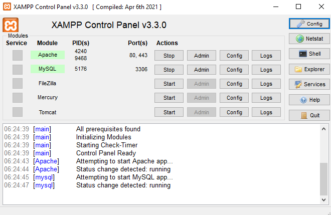
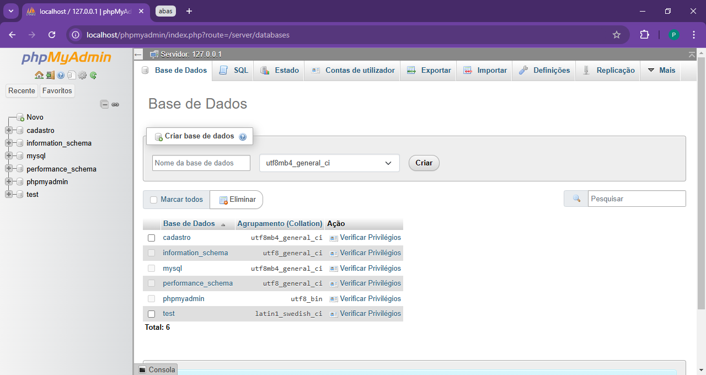
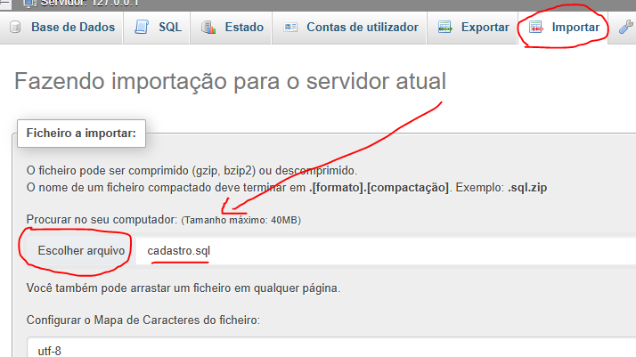
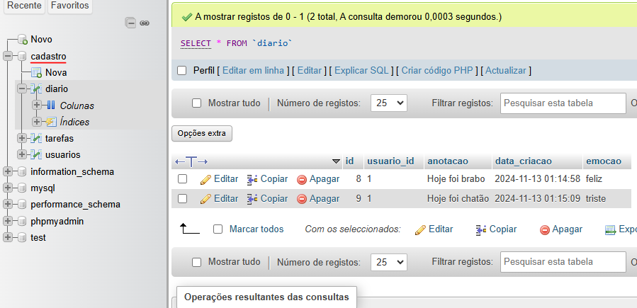
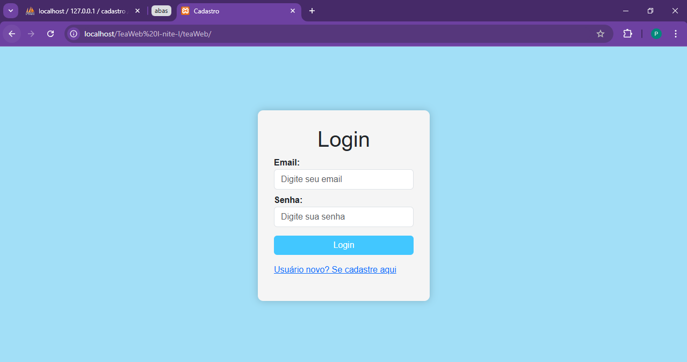

# TEAWeb

## O que é?

TEAWeb é um site desenvolvido com foco para crianças de 6 até 10 anos com autismo

## Instalação

1. **Instalação do xampp**

Você pode instalar o xampp aqui: [site do xampp](https://www.apachefriends.org/pt_br/download.html)

Só seguir os passos de instalação do executavel normalmente

2. **Mover os arquivos**

Mova os arquivos do TEAweb para a pasta do xampp em ```C:/xampp/htdocs/```

```
📁 C:/
└ 📁 xampp
  └ 📂 htdocs
     └ 📂 Coloque a pasta aqui
```

3. **Execute o Xampp Control**

Depois da instalação do Xampp, deverá aparecer o Xampp Control no menu Windows



> Caso não apareça, vá para ```C:/xampp/``` e execute o ```xampp-control.exe```

4. **Habilite o MySQL e o Apache no xampp**

Dentro do Xampp Control clique em ```start``` no Apache e no MySQL

 

5. **Importe o cadastro.sql**

Agora, escolha um navegador de sua preferência e vá para ```http://localhost/phpmyadmin/```

Irá abrir uma página dessa forma:



Dentro dessa página clique em  e depois selecione seu arquivo ***cadastro.sql***



Após isso clique em **Importar** para finalizar e seu Banco de Dados já deverá estar pronto



6. **Finalizando**

Após ter feito tudo, basta abrir a página em um navegador de sua preferência, colocando ```localhost/[Nome da pasta que você salvou anteriormente]```

